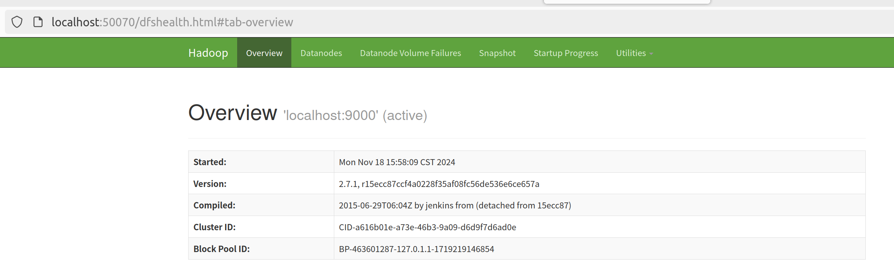
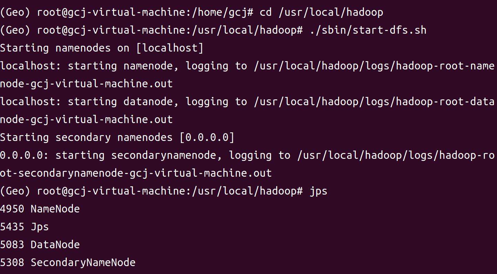

# HBase

#### 简介

HBase是一个开源的非关系型分布式数据库（NoSQL），它基于Google的Bigtable模型，并运行在Apache Hadoop的HDFS（Hadoop Distributed File System）之上。HBase提供了一个介于传统关系型数据库和简单的键值存储之间的解决方案，特别适合于处理大规模的、稀疏的、多维的、非结构化或半结构化的大数据集。

以下是HBase的一些关键特性和优势：

> [!IMPORTANT]
>
> 1. **列式存储**：HBase以列族（Column Family）的形式存储数据，这使得对列族内的数据进行批量读写操作变得高效。
>
> 2. **高可用性**：HBase设计为高可用性系统，它通过主从架构（Master和RegionServer）来实现。RegionServer负责处理数据的读写请求，而Master负责管理RegionServer和处理元数据操作。
>
> 3. **自动分片**：HBase表可以自动分割成多个区域（Region），这些区域可以在集群中动态分配，以支持数据的扩展和负载均衡。
>
> 4. **强一致性**：HBase提供读和写的强一致性保证，这对于需要高可靠性的应用场景非常重要。
>
> 5. **高并发**：HBase能够处理高并发的数据访问，适合于大规模的实时读写操作。
>
> 6. **可扩展性**：HBase可以水平扩展，通过增加更多的服务器来处理更多的数据和请求。
>
> 7. **与Hadoop集成**：HBase与Hadoop生态系统紧密集成，可以利用MapReduce进行批量处理和分析，以及与Hive、Pig等其他Hadoop组件协同工作。
>
> 8. **数据模型**：HBase的数据模型包括行键（Row Key）、列族、列限定符（Column Qualifier）和时间戳（Timestamp），这使得它非常适合于存储宽行数据。
>
> 9. **Coprocessor**：HBase支持协处理器（Coprocessor），这是一种可以在服务器端执行计算的插件，可以减少网络延迟和数据传输。
>
> 10. **REST和Thrift接口**：HBase提供了REST和Thrift API，允许用户通过不同的编程语言和客户端与HBase交互。

HBase适用于需要处理大量数据的场景，如时间序列数据存储、用户行为分析、机器学习数据存储等。由于其高性能和可扩展性，HBase成为了大数据领域中一个非常受欢迎的技术选择。

> [!IMPORTANT]
>
> 列式存储为什么被广泛用于OLAP(分析型数据库)中:
>
> **行式存储的原理与特点**
>
> 对于 OLAP 场景，大多都是对一整行记录进行增删改查操作的，那么行式存储采用以行的行式在磁盘上存储数据就是一个不错的选择。
>
> 当查询基于需求字段查询和返回结果时，由于这些字段都埋藏在各行数据中，就必须读取每一条完整的行记录，大量磁盘转动寻址的操作使得读取效率大大降低。
>
> 举个例子，下图为员工信息emp表。
> 
>
> 数据在磁盘上是以行的形式存储在磁盘上，同一行的数据紧挨着存放在一起。
>
> 
>
> 对于 emp 表，要查询部门 dept 为 A 的所有员工的名字。
>
> ~~~
> select name from emp where dept = A
> ~~~
>
> 由于 dept 的值是离散地存储在磁盘中，在查询过程中，需要磁盘转动多次，才能完成数据的定位和返回结果。
>
> 
>
> **列式存储的原理与特点**
>
> 对于 OLAP 场景，一个典型的查询需要遍历整个表，进行分组、排序、聚合等操作，这样一来行式存储中把一整行记录存放在一起的优势就不复存在了。而且，分析型 SQL 常常不会用到所有的列，而仅仅对其中某些需要的的列做运算，那一行中无关的列也不得不参与扫描。
>
> 然而在列式存储中，由于同一列的数据被紧挨着存放在了一起，如下图所示。
> 
>
> 那么基于需求字段查询和返回结果时，就不许对每一行数据进行扫描，按照列找到需要的数据，磁盘的转动次数少，性能也会提高。
>
> 还是上面例子中的查询，由于在列式存储中 dept 的值是按照顺序存储在磁盘上的，因此磁盘只需要顺序查询和返回结果即可。
>
> 
>
> 列式存储不仅具有按需查询来提高效率的优势，由于同一列的数据属于同一种类型，如数值类型，字符串类型等，相似度很高，还可以选择使用合适的编码压缩可减少数据的存储空间，进而减少IO提高读取性能。

**使用Web界面查看信息**

Hadoop成功启动后，可以在Linux系统中打卡一个浏览器，在地址栏输入地址

==Version3之后的地址==

~~~
http://localhost:50070
~~~

==Version3之前的地址==

~~~
http://localhost:9870
~~~

就可以查看名称节点和数据节点信息，还可以在线查看HDFS中的文件

~~~
localhost:9000
~~~

为HDFS的访问路径

#### 部署

##### 1.启动运行与停止HDFS

启动Hadoop

~~~
cd /usr/local/hadoop
./sbin/start-dfs.sh
~~~

启动HBase

~~~
cd /usr/local/hbase
bin/start-hbase.sh
~~~

进入HBase Shell模式

~~~
bin/hbase shell
~~~

完整流程

~~~
cd /usr/local/hadoop
./sbin/start-dfs.sh
cd /usr/local/hbase
./bin/start-hbase.sh
./bin/hbase shell
~~~

停止运行

~~~
bin/stop-hbase.sh
cd /usr/local/hadoop
./sbin/stop-dfs.sh
~~~

##### 2.HBase常用的Shell命令

###### 2.1 在HBase中创建表

假设需要创建一个表student，表中包含Sname、Ssex、Sage、Sdept、course 5个字段，在关系数据库中需要先创建数据库，再创建表。但在HBase数据库中，不需要创建数据库，直接创建表就可以。在HBase中创建student表的shell命令如下：

~~~
create 'student','Sname','Ssex','Sage','Sdept','course'
~~~

对于HBase而言，创建HBase时，无需自行创建行键，系统会默认一个属性作为行间，通常是把put命令操作中跟在表名后的第一个数据作为行键

创建为student表后，可通过describe命令查看student表的基本信息

~~~
describe 'student'
~~~

可以使用list命令查看当前HBase数据库中已经创建的表

~~~
list
~~~

###### 2.2 添加数据

HBase使用put命令添加数据，一次只能为一个表的一行数据的一个列(也就是一个单元格，单元格是HBase中的概念)添加一个数据。所以，直接用shell命令插入数据效率很低，在实际应用中，一般利用编程操作数据

~~~
put 'student','95001','Sname','LiYing'
~~~

上面的put命令会为student表添加学号为'95001'，名字为'LiYing'的一个单元格数据，其行键为95001，系统会默认把跟在表名student后面的第一个数据作为行键

下面继续添加4个单元格的数据

~~~
put 'student','95001','Ssex','male'
put 'student','95001','Sage','22'
put 'student','95001','Sdept','CS'
put 'student','95001','course:math','80'
~~~

###### 2.3 查看数据

HBase中有两个用于查看数据的命令

(1)get命令：用于查看表的某个单元格数据

(2)scan命令：用于查看某个表的全部数据

例如可以使用如下命令返回student表中95001行的数据：

~~~
get 'student','95001'
~~~

也可以通过scan命令查看student表中的所有信息

~~~
scan 'student'
~~~

###### 2.4 删除数据

在HBase中用delete以及deleteall命令进行删除数据操作

> [!IMPORTANT]
>
> 两者的区别：
>
> delete用于删除一个单元格数据，是put的反向操作；而deleteall命令用于删除一行数据。

首先使用delete命令删除student表中95001这行中的Ssex列的所有数据，命令如下：

~~~
delete 'student','95001','Ssex'
~~~

此时的student表

95001这行中的Ssex列的所有数据已经被删除

然后使用deleteall命令删除student表中的95001行的全部数据，命令如下：

~~~
deleteall 'student','95001'
~~~

###### 2.5 删除表

删除表需要分两步操作：第一步让该表不可用；第二步删除表。例如，要删除表，可以使用如下命令：

~~~
disable 'student'
drop 'student'
~~~

###### 2.6 查询历史数据

​	在添加数据时，HBase会自动为添加的数据添加一个时间戳。在修改数据时，HBase会为修改后的数据生成一个新的版本(时间戳)，从而完成'改'操作，旧的版本依旧保留，系统会定时回收垃圾数据，只留下最新的几个版本，保存的版本数可以在创建表时指定

​	为了查询历史数据，这里创建一个teacher表，在创建表时，需要指定保存的版本数(假设指定为5)，命令如下：

~~~
create 'teacher',{NAME=>'username',VERSIONS=>5}
~~~

插入数据，并更新数据，使其产生历史版本数据，需要注意的是，这里插入数据和更新数据都是使用put命令，具体如下：

~~~
put 'teacher','91001','username','Mary'
put 'teacher','91001','username','Mary1'
put 'teacher','91001','username','Mary2'
put 'teacher','91001','username','Mary3'
put 'teacher','91001','username','Mary4'
put 'teacher','91001','username','Mary5'
~~~

查询时默认情况下会显示当前最新版本的数据，如果要查询历史数据，需要指定查询的历史版本数，由于上面设置了保存版本数为5，所有，在查询时指定的历史版本数的有效取值为1~5，具体命令如下：

~~~
get 'teacher','91001',{COLUMN=>'username',VERSIONS=>5}
get 'teacher','91001',{COLUMN=>'username',VERSIONS=>3}
~~~

###### 2.7 退出HBase数据库

~~~
exit
bin/stop-hbase.sh
~~~

###### 测试程序(Java)

运行前启动Hadoop和HBase

~~~
import org.apache.hadoop.conf.Configuration;
import org.apache.hadoop.hbase.*;
import org.apache.hadoop.hbase.client.*;
import org.apache.hadoop.hbase.util.Bytes;

import java.io.IOException;
public class ExampleForHBase {
    public static Configuration configuration;
    public static Connection connection;
    public static Admin admin;
    public static void main(String[] args)throws IOException{
        init();
        createTable("student",new String[]{"score"});
        insertData("student","zhangsan","score","English","69");
        insertData("student","zhangsan","score","Math","86");
        insertData("student","zhangsan","score","Computer","77");
        getData("student", "zhangsan", "score","English");
        close();
    }

    public static void init(){
        configuration  = HBaseConfiguration.create();
        configuration.set("hbase.rootdir","hdfs://localhost:9000/hbase");
        try{
            connection = ConnectionFactory.createConnection(configuration);
            admin = connection.getAdmin();
        }catch (IOException e){
            e.printStackTrace();
        }
    }

    public static void close(){
        try{
            if(admin != null){
                admin.close();
            }
            if(null != connection){
                connection.close();
            }
        }catch (IOException e){
            e.printStackTrace();
        }
    }

    public static void createTable(String myTableName,String[] colFamily) throws IOException {
        TableName tableName = TableName.valueOf(myTableName);
        if(admin.tableExists(tableName)){
            System.out.println("table is exists!");
        }else {
            TableDescriptorBuilder tableDescriptor = TableDescriptorBuilder.newBuilder(tableName);
            for(String str:colFamily){
                ColumnFamilyDescriptor family =
                        ColumnFamilyDescriptorBuilder.newBuilder(Bytes.toBytes(str)).build();
                tableDescriptor.setColumnFamily(family);
            }
            admin.createTable(tableDescriptor.build());
        }
    }

    public static void insertData(String tableName,String rowKey,String colFamily,String col,String val) throws IOException {
        Table table = connection.getTable(TableName.valueOf(tableName));
        Put put = new Put(rowKey.getBytes());
        put.addColumn(colFamily.getBytes(),col.getBytes(), val.getBytes());
        table.put(put);
        table.close();
    }

    public static void getData(String tableName,String rowKey,String colFamily, String col)throws  IOException{
        Table table = connection.getTable(TableName.valueOf(tableName));
        Get get = new Get(rowKey.getBytes());
        get.addColumn(colFamily.getBytes(),col.getBytes());
        Result result = table.get(get);
        System.out.println(new String(result.getValue(colFamily.getBytes(),col==null?null:col.getBytes())));
        table.close();
    }
}
~~~

进入HBase命令行：

~~~
cd /usr/local/hbase
./bin/hbase shell
~~~

~~~
list
~~~

~~~
scan 'student'
~~~

-------------------------

###### 测试程序(Python):使用thrift管理HBase

**安装thrift库和happybase库：**

~~~
pip  install thrift
pip  install happybase
~~~

运行前先启动Hadoop和HBase

再启动thrift:

~~~
cd /usr/local/hbase
bin/hbase-daemon.sh start thrift
~~~

> [!IMPORTANT]
>
> **hbase-thrift报错**
>
> python连接hbase时可能需要用到hbase-thirft类库，但是hbase-thirft只在python2下能正常使用，如果在python3下会报错
>
> ~~~
> 主要有以下几个错误
> 
> except IOError, io:
> 
> SyntaxError: invalid syntax
> 
> ModuleNotFoundError: No module named ‘ttypes’
> 
> NameError:name ‘xrange’ is not defined
> 
> 这几个都是python3和python2语法不兼容导致的
> ~~~
>
> **解决方法**
>
> 替换site-packages下的Hbase.py文件和ttpyes.py文件
>
> 链接：
>
> ~~~
> https://github.com/Me106y/HBase-resource
> ~~~
>
> **测试代码：**
>
> ~~~
> from thrift import Thrift
> from thrift.transport import TSocket, TTransport
> from thrift.protocol import TBinaryProtocol
> from hbase import Hbase
> from hbase.ttypes import ColumnDescriptor, Mutation, BatchMutation, TRegionInfo
> from hbase.ttypes import IOError, AlreadyExists
> 
> # thrift默认端口是9090
> socket = TSocket.TSocket('127.0.0.1', 9090)
> socket.setTimeout(5000)
> transport = TTransport.TBufferedTransport(socket)
> protocol = TBinaryProtocol.TBinaryProtocol(transport)
> client = Hbase.Client(protocol)
> socket.open()
> 
> print(client.getTableNames())  # 获取当前所有的表名
> 
> ~~~
>
> **超时问题**
>
> ~~~
> thrift.transport.TTransport.TTransportException: read timeout
> ~~~
>
> **解决办法**
>
> 可以将socket.setTimeout的时间调长，例如：
>
> ~~~
> socket.setTimeout(50000)
> ~~~
>
> 

#### 启动(快捷)

~~~
cd /usr/local/hadoop
./sbin/start-dfs.sh

cd /usr/local/hbase
bin/start-hbase.sh

cd /usr/local/hbase
bin/hbase-daemon.sh start thrift
~~~

#### 详细

##### 1.HBase的数据结构

###### **1.1 RowKey:**

Rowkey是用来检索记录的唯一主键，类似于key。访问HBase中的表数据，只能通过Rowkey来查找，访问HBase的数据只有三种方式：

~~~
通过get指令访问单个rowkey对应的数据。
通过scan指令，默认全表扫描
通过scan指令，指定rowkey的范围，进行范围查找。
~~~

Rowkey可以是任意字符串，最大长度是64KB，实际中通常用不到这么长。在HBase内部，Rowkey保存为字节数组。存储时，会按照Rowkey的字典顺序排序存储。在实际使用时，对Rowkey的设计是很重要的，往往需要将一些经常读取的重要列都包含到Rowkey中。并且要充分考虑到排序存储这个特性，让一些相关的数据尽量放到一起。
比如我们创建一个用户表，经常会按用户ID来查询， 那Rowkey中一定要包含用户ID字段。而如果把用户ID放在Rowkey的开头，那数据就会按照用户ID排序存储，查询Rowkey时效率就会比较快。

###### **1.2 Column Family:**

Column Family 即列族，HBase 基于列划分数据的物理存储，一个列族可以包含包意多列。

一般同一类的列会放在一个列族中，每个列族都有一组存储属性：

~~~
是否应该缓存在内存中；
数据如何被压缩或行键如何编码等。
~~~

> [!IMPORTANT]
>
> > HBase 在创建表的时候就必须指定列，族列名都以列族作为前缀。例如 courses:history，courses:math都属于courses 这个列族。HBase的列族不是越多越好，官方荐一个表的列族数量最好小于或者等于3，过多的列族不利于 HBase 数据的管理和索引

###### **1.3 Region:**

HBase 将表中的数据基于 RowKey 的不同范围划分到不同 Region 上，每个Region都负责一定范围的数据存储和访问。

每个表一开始只有一个 Region，随着数据不断插入表，Region 不断增大，当增大到一个阀值的时候，Region 就会等分成两个新的 Region。当table中的行不断增多，就会有越来越多的 Region。

==另外，Region 是 Hbase 中分布式存储和负载均衡的最小单元，不同的 Region 可以分布在不同的 HRegion Server上。但一个Hregion是不会拆分到多个server上的。==

这样即使有一个包括上百亿条数据的表，由于数据被划分到不同的 Region上，每个 Region 都可以独立地进行写入和查询，HBase 写查询时候可以于多 Region 分布式并发操作，因此访问速度也不会有太大的降低

###### **1.4 Cell:**

由{rowkey, column Family:columu, version} 唯一确定的单元。cell中的数据是==没有类型的==，全部是==字节码==形式存储。

###### **1.5 Time Stamp**:

每个 cell都保存 着同一份数据的多个版本。版本通过时间戳来索引。时间戳的类型是 64位整型。时间戳可以由HBASE(在数据写入时自动 )赋值，此时时间戳是精确到毫秒 的当前系统时间。时间戳也可以由客户显式赋值。如果应用程序要避免数据版本冲突，就必须自己生成具有唯一性的时间戳。每个cell中，不同版本的数据按照时间倒序排序，即最新的数据排在最前面。
为了避免数据存在过多版本造成的的管理 (包括存贮和索引)负担，HBASE提供 了两种数据版本回收方式。一是保存数据的最后n个版本，二是保存最近一段 时间内的版本(比如最近七天)。用户可以针对每个列族进行设置。

###### **1.6 NameSpace:**

命名空间结构：

+ Table：表，所有的表都是命名空间的成员，即表必属于某个命名空间，如果没有指定，则在default默认的命名空间中。
+ RegionServer group：一个命名空间包含了默认的RegionServer Group。
+ Permission：权限，命名空间能够让我们来定义访问控制列表ACL（Access Control List）。例如，创建表，读取表，删除，更新等等操作。
+ Quota：限额，可以强制一个命名空间可包含的region的数量。
  

##### 2.HBase 的架构组成

HBase 的核心架构由五部分组成，分别是 HBase Client、HMaster、Region Server、ZooKeeper 以及 HDFS。它的架构组成如下图所示。

###### 2.1 HBase Client

HBase Client 为用户提供了访问 HBase 的接口，可以通过元数据表来定位到目标数据的 RegionServer，另外 HBase Client 还维护了对应的 cache 来加速 Hbase 的访问，比如缓存元数据的信息。

###### 2.2 HMaster

HMaster 是 HBase 集群的主节点，负责整个集群的管理工作，主要工作职责如下：

+ 分配Region：负责启动的时候分配Region到具体的 RegionServer；
+ 负载均衡：一方面负责将用户的数据均衡地分布在各个 Region Server 上，防止Region Server数据倾斜过载。另一方面负责将用户的请求均衡地分布在各个 Region Server 上，防止Region Server 请求过热；
+ 维护数据：发现失效的 Region，并将失效的 Region 分配到正常的 RegionServer 上，并且在Region Sever 失效的时候，协调对应的HLog进行任务的拆分。
  

###### 2.3 Region Server

Region Server 直接对接用户的读写请求，是真正的干活的节点，主要工作职责如下。

+ 管理 HMaster 为其分配的 Region；

+ 负责与底层的 HDFS 交互，存储数据到 HDFS；

+ 负责 Region 变大以后的拆分以及 StoreFile 的合并工作。

与 HMaster 的协同：当某个 RegionServer 宕机之后，ZK 会通知 Master 进行失效备援。下线的 RegionServer 所负责的 Region 暂时停止对外提供服务，Master 会将该 RegionServer 所负责的 Region 转移到其他 RegionServer 上，并且会对所下线的 RegionServer 上存在 MemStore 中还未持久化到磁盘中的数据由 WAL 重播进行恢复。

下面详细介绍下 Region Serve数据存储的基本结构，如下图所示。一个 Region Server 是包含多个 Region 的，这里仅展示一个。

+ Region：每一个 Region 都有起始 RowKey 和结束 RowKey，代表了存储的Row的范围，保存着表中某段连续的数据。一开始每个表都只有一个 Region，随着数据量不断增加，当 Region 大小达到一个阀值时，Region 就会被 Regio Server 水平切分成两个新的 Region。当 Region 很多时，HMaster 会将 Region 保存到其他 Region Server 上。

+ Store：一个 Region 由多个 Store 组成，每个 Store 都对应一个 Column Family, Store 包含 MemStore 和 StoreFile。  

  - MemStore：作为HBase的内存数据存储，数据的写操作会先写到 MemStore 中，当MemStore 中的数据增长到一个阈值（默认64M）后，Region Server 会启动 flasheatch 进程将 MemStore 中的数据写人 StoreFile 持久化存储，每次写入后都形成一个单独的 StoreFile。当客户端检索数据时，先在 MemStore中查找，如果MemStore 中不存在，则会在 StoreFile 中继续查找。

  - StoreFile：MemStore 内存中的数据写到文件后就是StoreFile，StoreFile底层是以 HFile 的格式保存。HBase以Store的大小来判断是否需要切分Region。

当一个Region 中所有 StoreFile 的大小和数量都增长到超过一个阈值时，HMaster 会把当前Region分割为两个，并分配到其他 Region Server 上，实现负载均衡。

+ HFile：HFile 和 StoreFile 是同一个文件，只不过站在 HDFS 的角度称这个文件为HFile，站在HBase的角度就称这个文件为StoreFile。
+ HLog：负责记录着数据的操作日志，当HBase出现故障时可以进行日志重放、故障恢复。例如，磁盘掉电导致 MemStore中的数据没有持久化存储到 StoreFile，这时就可以通过HLog日志重放来恢复数据。

###### 2.4 ZooKeeper

HBase 通过 ZooKeeper 来完成选举 HMaster、监控 Region Server、维护元数据集群配置等工作，主要工作职责如下：

+ 选举HMaster：通ooKeeper来保证集中有1HMaster在运行，如果 HMaster 异常，则会通过选举机制产生新的 HMaster 来提供服务；
+ 监控Region Server: 通过 ZooKeeper 来监控 Region Server 的状态，当Region Server 有异常的时候，通过回调的形式通知 HMaster 有关Region Server 上下线的信息；
+ 维护元数据和集群配置：通过ooKeeper储B信息并对外提供访问接口。
  

###### 2.5 HDFS

HDFS 为 HBase 提供底层数据存储服务，同时为 HBase提供高可用的支持， HBase 将 HLog 存储在 HDFS 上，当服务器发生异常宕机时，可以重放 HLog 来恢复数据。

##### 3. HBase的写入流程

###### 3.1 Region Server 寻址

~~~
1.HBase Client 访问 ZooKeeper；
2.获取写入 Region 所在的位置，即获取 hbase:meta 表位于哪个 Region Server；
3.访问对应的 Region Server；
4.获取 hbase:meta 表，并查询出目标数据位于哪个 Region Server 中的哪个 Region 中。并将该 table 的 Region 信息以及 meta 表的位置信息缓存在客户端的 meta cache，方便下次访问；
~~~

###### 3.2 写 Hlog

~~~
1.HBase Client 向 Region Server 发送写 Hlog 请求；
2.Region Server 会通过顺序写入磁盘的方式，将 Hlog 存储在 HDFS 上；
~~~

###### 3.3 写 MemStore 并返回结果

~~~
1.HBase Client 向 Region Server 发送写 MemStore 请求；
2.只有当写 Hlog 和写 MemStore 的请求都成功完成之后，并反馈给 HBase Client，这时对于整个 HBase Client 写入流程已经完成。
~~~

###### 3.4 MemStore 刷盘

HBase 会根据 MemStore 配置的刷盘策略定时将数据刷新到 StoreFile 中，完成数据持久化存储。

> [!IMPORTANT]
>
> 为什么要把 WAL 加载到 MemStore中，再刷写成 HFile 呢？
>
> ~~~
> WAL (Write-Ahead-Log) 预写日志是 HBase 的 RegionServer 在处理数据插入和删除过程中用来记录操作内容的一种日志。每次Put、Delete等一条记录时，首先将其数据写入到 RegionServer 对应的 HLog 文件中去。
> 
> 而WAL是保存在HDFS上的持久化文件，数据到达 Region 时先写入 WAL，然后被加载到 MemStore 中。这样就算Region宕机了，操作没来得及执行持久化，也可以再重启的时候从 WAL 加载操作并执行。
> 
> 那么，我们从写入流程中可以看出，数据进入 HFile 之前就已经被持久化到 WAL了，而 WAL 就是在 HDFS 上的，MemStore 是在内存中的，增加 MemStore 并不能提高写入性能，为什么还要从 WAL 加载到 MemStore中，再刷写成 HFile 呢？
> 
> · 数据需要顺序写入，但 HDFS 是不支持对数据进行修改的；
> 
> · WAL 的持久化为了保证数据的安全性，是无序的；
> 
> · Memstore在内存中维持数据按照row key顺序排列，从而顺序写入磁盘；
> 
> 所以 MemStore 的意义在于维持数据按照RowKey的字典序排列，而不是做一个缓存提高写入效率。
> ~~~

##### 4. HBase 的读流程

###### 4.1 Region Server 寻址

HBase Client 请求 ZooKeeper 获取元数据表所在的 Region Server的地址。

###### 4.2 Region 寻址

HBase Client 请求 RegionServer 获取需要访问的元数据，查询出目标数据位于哪个 Region Server 中的哪个 Region 中。并将该 table 的 region 信息以 及 meta 表的位置信息缓存在客户端的 meta cache，方便下次访问。

###### 4.3 数据读取

HBase Client 请求数据所在的 Region Server，获取所需要的数据。 Region 首先在 MemStore 中查找，若命中则返回；如果在MemStore 中找不到，则通过 BloomFilter 判断数据是否存在；如果存在，则在StoreFile 中扫描并将结果返回客户端。

##### 5. HBase 的数据删除

HBase 的数据删除操作并不会立即将数据从磁盘上删除，因为 HBase 的数据通常被保存在 HDFS 中，而 HDFS 只允许新增或者追加数据文件，所以删除操作主要对要被删除的数据进行标记。

当执行删除操作时，HBase 新插入一条相同的 Key-Value 数据，但是
keyType=Delete，这便意味着数据被删除了，直到发生 Major_compaction 操作，数据才会真正地被从磁盘上删除。

HBase这种基于标记删除的方式是按顺序写磁盘的的，因此很容易实现海量数据的快速删除，有效避免了在海量数据中查找数据、执行删除及重建索引等复杂的流程。

##### 6.  HBaseAPI(Java版)

###### 6.1 获取Configuration对象

~~~
public static Configuration conf;
static{
	conf  = HBaseConfiguration.create();
	conf.set("hbase.rootdir","hdfs://localhost:9000/hbase");
}
~~~

###### 6.2 判断表是否存在

~~~
public static boolean isTableExist(String tableName) throws MasterNotRunningException,
 ZooKeeperConnectionException, IOException{
	//在HBase中管理、访问表需要先创建HBaseAdmin对象
	//Connection connection = ConnectionFactory.createConnection(conf);
	//HBaseAdmin admin = (HBaseAdmin) connection.getAdmin();
	HBaseAdmin admin = new HBaseAdmin(conf);
	return admin.tableExists(tableName);
}
~~~

###### 6.3 创建表

~~~
public static void createTable(String myTableName,String[] colFamily) throws IOException {
        TableName tableName = TableName.valueOf(myTableName);
        if(admin.tableExists(tableName)){
            System.out.println("table is exists!");
        }else {
            TableDescriptorBuilder tableDescriptor = TableDescriptorBuilder.newBuilder(tableName);
            for(String str:colFamily){
                ColumnFamilyDescriptor family =
                        ColumnFamilyDescriptorBuilder.newBuilder(Bytes.toBytes(str)).build();
                tableDescriptor.setColumnFamily(family);
            }
            admin.createTable(tableDescriptor.build());
        }
    }
~~~

###### 6.4  删除表

~~~
public static void dropTable(String tableName) throws MasterNotRunningException,
 ZooKeeperConnectionException, IOException{
	HBaseAdmin admin = new HBaseAdmin(conf);
	if(isTableExist(tableName)){
		admin.disableTable(tableName);
		admin.deleteTable(tableName);
		System.out.println("表" + tableName + "删除成功！");
	}else{
		System.out.println("表" + tableName + "不存在！");
	}
}
~~~

###### 6.5 向表中插入数据

~~~
public static void addRowData(String tableName, String rowKey, String columnFamily, String
 column, String value) throws IOException{
	//创建HTable对象
	HTable hTable = new HTable(conf, tableName);
	//向表中插入数据
	Put put = new Put(Bytes.toBytes(rowKey));
	//向Put对象中组装数据
	put.add(Bytes.toBytes(columnFamily), Bytes.toBytes(column), Bytes.toBytes(value));
	hTable.put(put);
	hTable.close();
	System.out.println("插入数据成功");
}
~~~

###### 6.6 删除多行数据

~~~
public static void deleteMultiRow(String tableName, String[] rows) throws IOException{
	HTable hTable = new HTable(conf, tableName);
	List<Delete> deleteList = new ArrayList<Delete>();
	for(String row : rows){
		Delete delete = new Delete(Bytes.toBytes(row));
		deleteList.add(delete);
	}
	hTable.delete(deleteList);
	hTable.close();
}
~~~

###### 6.7 获取所有数据

~~~
public static void getAllRows(String tableName) throws IOException{
	HTable hTable = new HTable(conf, tableName);
	//得到用于扫描region的对象
	Scan scan = new Scan();
	//使用HTable得到resultcanner实现类的对象
	ResultScanner resultScanner = hTable.getScanner(scan);
	for(Result result : resultScanner){
		Cell[] cells = result.rawCells();
		for(Cell cell : cells){
			//得到rowkey
			System.out.println("行键:" + Bytes.toString(CellUtil.cloneRow(cell)));
			//得到列族
			System.out.println("列族" + Bytes.toString(CellUtil.cloneFamily(cell)));
			System.out.println("列:" + Bytes.toString(CellUtil.cloneQualifier(cell)));
			System.out.println("值:" + Bytes.toString(CellUtil.cloneValue(cell)));
		}
	}
}
~~~

###### 6.8 获取某一行数据

~~~
public static void getRow(String tableName, String rowKey) throws IOException{
	HTable table = new HTable(conf, tableName);
	Get get = new Get(Bytes.toBytes(rowKey));
	//get.setMaxVersions();显示所有版本
    //get.setTimeStamp();显示指定时间戳的版本
	Result result = table.get(get);
	for(Cell cell : result.rawCells()){
		System.out.println("行键:" + Bytes.toString(result.getRow()));
		System.out.println("列族" + Bytes.toString(CellUtil.cloneFamily(cell)));
		System.out.println("列:" + Bytes.toString(CellUtil.cloneQualifier(cell)));
		System.out.println("值:" + Bytes.toString(CellUtil.cloneValue(cell)));
		System.out.println("时间戳:" + cell.getTimestamp());
	}
}
~~~

##### 7. HBaseAPI(Python版)

###### 7.1 连接HBase(获取Configuration对象)

~~~
import happybase

con = happybase.Connection('192.168.175.128')
con.open()  # 打开thrift传输，TCP连接
print(con.tables())  # 输出所有表名
con.close()  # 关闭传输

~~~

> [!IMPORTANT]
>
> Connection中传本地IP(可通过ifconfig查询)

也可直接传localhost

~~~
con = happybase.Connection("localhost")
~~~

###### 7.2 判断表是否存在

> [!IMPORTANT]
>
> `con.tables()` 返回的是一个列表，其中的元素是字节串（bytes），而不是字符串。因此，当你检查 `tablename` 是否存在于 `tables` 列表中时，你需要确保 `tablename` 也是一个字节串。你可以通过将字符串前加上 `b` 前缀来创建一个字节串，或者使用 `encode()` 方法将字符串编码为字节串。

~~~
import happybase

def isTableExist(tablename):
    con = happybase.Connection('192.168.175.128')
    con.open()  # 打开传输
    tables = con.tables()
    if tablename.encode('utf-8') in tables:
        print(f"{tablename} is exist!")
    else:
        print(f"{tablename} is not exist!")
~~~

###### 7.3 创建表

~~~
import happybase

def create_table(tablename, familes):
    tables = con.tables()
    if tablename.encode('utf-8') in tables:
        print(f"{tablename} is exist!")
    else:
        con.create_table(tablename, familes)

con = happybase.Connection('192.168.175.128')
con.open()
~~~

**配置选项**

~~~
1.max_versions (int类型)：

这个参数指定了HBase表中每个单元（cell）可以存储的最大版本数。HBase是一个多版本的数据库，这意味着同一个单元可以存储多个版本的数据。如果设置为1，那么每个单元只能存储一个版本的数据；如果设置为更大的数字，可以存储更多版本的数据。

2.compression (str类型)：

这个参数用于指定数据压缩算法。HBase支持多种压缩算法，如NONE、GZ（gzip）、LZO、SNAPPY等。选择合适的压缩算法可以减少存储空间的使用，但可能会增加CPU的使用率，因为压缩和解压缩数据需要计算资源。

3.in_memory (bool类型)：

这个参数指示是否将表的数据存储在内存中。如果设置为True，HBase会尝试将表的数据缓存在内存中，这样可以提高读取速度。但是，这会消耗更多的内存资源。

4.bloom_filter_type (str类型)：

这个参数指定了布隆过滤器的类型。布隆过滤器是一种空间效率很高的概率型数据结构，用于判断一个元素是否在一个集合中。HBase支持ROW、ROWCOL、NONE等类型的布隆过滤器。ROW表示布隆过滤器仅适用于行键，ROWCOL表示同时适用于行键和列族键。

5.bloom_filter_vector_size (int类型)：

这个参数指定了布隆过滤器的向量大小。向量大小越大，布隆过滤器的准确性越高，但占用的空间也越多。

6.bloom_filter_nb_hashes (int类型)：

这个参数指定了布隆过滤器使用的哈希函数的数量。哈希函数的数量越多，布隆过滤器的准确性越高，但同样会增加误判率。

7.block_cache_enabled (bool类型)：

这个参数指示是否启用块缓存。块缓存是一种优化读取性能的技术，它将数据块缓存在内存中，以便快速访问。如果设置为True，可以提高读取性能，但会消耗更多的内存资源。

8.time_to_live (int类型)：

这个参数指定了数据的存活时间（TTL）。单位通常是毫秒。如果设置了一个TTL值，那么表中的数据在存活时间过后会自动被删除。
~~~

###### 7.4 启动或禁用表

~~~
import happybase
 
con = happybase.Connection('192.168.175.128')
con.open()
 
con.disable_table('fruit')  # 禁用表，games代表表名
print(con.is_table_enabled('fruit'))  # 查看表的状态，False代表禁用，True代表启动
print(con.tables())  # 即使禁用了该表，该表还是存在的，只是状态改变了
~~~

~~~
import happybase
 
con = happybase.Connection('192.168.175.128')
con.open()
 
con.disable_table('fruit')  # 禁用表，games代表表名
print(con.is_table_enabled('fruit'))  # 查看表的状态，False代表禁用，True代表启动
print(con.tables())  # 即使禁用了该表，该表还是存在的，只是状态改变了
~~~

###### 7.5 删除表

删除一个表要先将该表禁用，之后才能删除。HappyBase 的delete_table函数不但可以禁用表还可以删除表。如果前面已经禁用了该表，delete_table函数就可以不用加第二个参数，默认为False

~~~
import happybase

def delete_table(tablename):
    tables = con.tables()
    if tablename.encode('utf-8') in tables:
        con.delete_table(tablename, disable=True)
    else:
        print(f"{tablename} is not exist!")

con = happybase.Connection('192.168.175.128')
con.open()
print("删除前：", con.tables())
delete_table("teacher")
print("删除后：", con.tables())
con.close()
~~~

###### 7.6 建立数据

如果写数据时没有这个列名，就新建这样的列名，再写数据。

在 hbase shell 中，使用put命令，一次只能写入一个单元格，而happybase库的put函数能写入多个。

~~~
import happybase

con = happybase.Connection('192.168.175.128')
con.open()
table = con.table("fruit")

apple1 = {
    'apple:color': 'red',
    'apple:size': '18'
}

table.put('0001', apple1)

one_row = table.row('0001')  # 获取一行数据,0001是行键
for value in one_row.keys():  # 遍历字典
    print(value.decode('utf-8'), one_row[value].decode('utf-8'))  # 可能有中文，使用encode转码

con.close()
~~~

提交数据，0001代表行键，写入的数据要使用字典形式表示

###### 7.7 查看数据

~~~
import happybase

con = happybase.Connection('192.168.175.128')
con.open()  # 打开传输

table = con.table('fruit')  

one_row = table.row('0001')  # 获取一行数据,0001是行键
for value in one_row.keys():  # 遍历字典
    print(value.decode('utf-8'), one_row[value].decode('utf-8'))  # 可能有中文，使用encode内置函数转码

print(table.cells('0001', 'apple:color')[0].decode('utf-8'))  # 获取一个单元格信息，返回列表，转码输出

for key, value in table.rows(['0001', '0002']):
    for index in value.keys():  # 遍历字典
        print(key.decode('utf-8'), index.decode('utf-8'), value[index].decode('utf-8'))  # 可能有中文，使用encode转码

for rowkey, Column_Family in table.scan():  # 获取扫描器对象，该对象是可迭代对象。扫描器记录了一个表的结构
    # print(rowkey, '<=====>', liecu)
    for index in Column_Family.keys():  # 遍历字典
        print(rowkey.decode('utf-8'), index.decode('utf-8'), Column_Family[index].decode('utf-8'))  # 可能有中文，使用encode转码

con.close()  # 关闭传输
~~~

###### 7.8 删除数据

> [!IMPORTANT]
>
> hbase的删除是根据时间戳来删除最近的版本，再次查看时显示的下一个最近的版本，但happybase库的 delete 函数封装的是 hbase shell 中的 deleteall 函数，所以调用要delete函数时要谨慎

~~~
table.delete('0001', ['apple:color'])
~~~

###### 7.9 批量操作

批量操作可以有效地减少对数据库的请求次数，提高数据的写入速度。

~~~
import happybase

# 连接到HBase Thrift服务器
connection = happybase.Connection('localhost')
table = connection.table('mytable')

# 批量写入数据
batch = table.batch()
for i in range(1000):
    batch.put(f'row{i}'.encode(), b'cf:col1', f'value{i}'.encode())

# 执行批量写入
batch.send()
~~~

###### 7.10 数据库迁移

数据库迁移是将数据从一个数据库系统转移到另一个数据库系统的过程。以下是使用`HappyBase`将数据从MySQL迁移到HBase的示例。数据库迁移是将数据从一个数据库系统转移到另一个数据库系统的过程。以下是使用`HappyBase`将数据从MySQL迁移到HBase的示例。

在此之前，使用pymysql测试连接MySQL数据库

~~~
import pymysql

# 连接到MySQL数据库
mysql_conn = pymysql.connect(host='localhost', user='root', password='123456', port=3306)
# 创建数据库的游标
mysql_cursor = mysql_conn.cursor()

# execute()方法并执行 SQL 语句
mysql_cursor.execute("select version()")

# 读取第一条数据
data = mysql_cursor.fetchone()
print(data)
# 关闭连接
mysql_conn.close()
~~~

> [!IMPORTANT]
>
> 此处省略hbase创建表过程

~~~
import happybase
import pymysql

# 连接到MySQL数据库
mysql_conn = pymysql.connect(host='localhost', user='root', password='123456', port=3306, db='user')

# 创建数据库的游标
mysql_cursor = mysql_conn.cursor()

# 连接到HBase数据库
hbase_conn = happybase.Connection('192.168.175.128')
hbase_table = hbase_conn.table('Test')
hbase_conn.open()

# 读取MySQL数据
mysql_cursor.execute('SELECT id, name, age FROM users')
rows = mysql_cursor.fetchall()

for row in rows:
    hbase_table.put(str(row[0]), {'users:name': row[1], 'users:age': str(row[2])})

for rowkey, Column_Family in hbase_table.scan():  # 获取扫描器对象，该对象是可迭代对象。扫描器记录了一个表的结构

    for index in Column_Family.keys():  # 遍历字典
        print(rowkey.decode('utf-8'), index.decode('utf-8'), Column_Family[index].decode('utf-8'))  # 可能有中文，使用encode转码

# 关闭连接
mysql_conn.close()
hbase_conn.close()

~~~

##### 8. 大数据应用

在大数据处理场景中，`HappyBase`可以与Hadoop和Spark等大数据技术结合使用，以下是一个示例。

> [!IMPORTANT]
>
> 需要先配置hbase的相关资源

~~~
from pyspark.sql import SparkSession
import happybase

# 创建Spark会话
spark = SparkSession.builder.appName('HBaseExample').getOrCreate()

# 读取HBase数据
hbase_df = spark.read.format('org.apache.spark.sql.execution.datasources.hbase.HBaseTableScan').option('hbase.table.name', 'Test').option('hbase.zookeeper.quorum', 'localhost').load()
hbase_df.show()
# 处理数据
result_df = hbase_df.filter(hbase_df['users:age'] > 1)
result_df.show()
# 将结果写回HBase
result_df.write.format('org.apache.spark.sql.execution.datasources.hbase.HBaseTableWrite').option('hbase.table.name', 'result_table').option('hbase.zookeeper.quorum', 'localhost').save()

# 关闭Spark会话
spark.stop()

~~~

